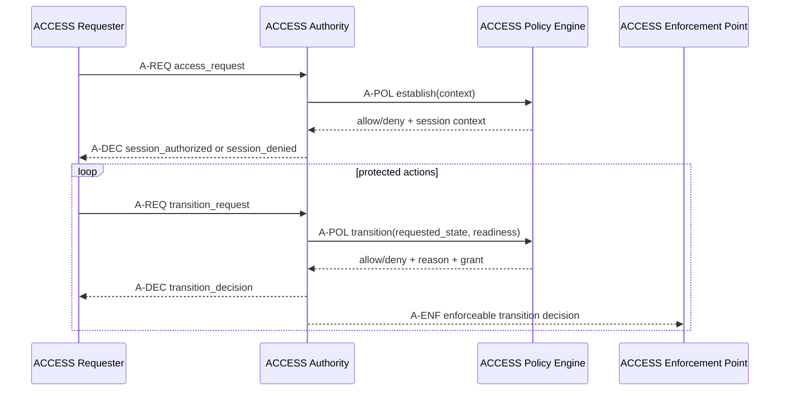
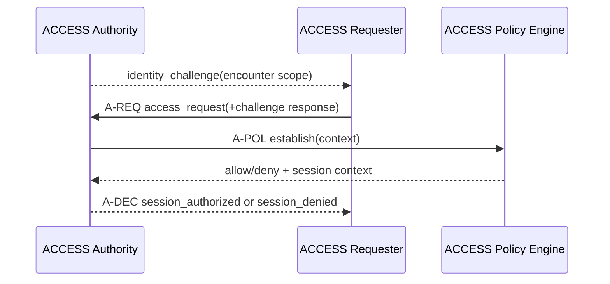

# ACCESS Protocol Flows

## Purpose

This document defines standard ACCESS interaction flows that can be reused
across mission use cases. Each flow reuses a common protocol envelope and
security invariants while varying initiation, approval path, and session
lifecycle behavior.

Use-case documents such as docking or refueling should select one flow profile
from this catalog and then specify policy, claims, and safety evidence details.

## Normative roles and interfaces

ACCESS defines protocol roles independent of implementation technology.

| Role ID | Role name | Responsibility |
| --- | --- | --- |
| AR | ACCESS Requester | Requests authorization for protected actions |
| AA | ACCESS Authority | Validates protocol messages and issues authorization decisions |
| APE | ACCESS Policy Engine | Evaluates policy and evidence, returns allow or deny outputs |
| AEP | ACCESS Enforcement Point | Enforces transition or actuation using issued decision or grant |
| AES | ACCESS Evidence Service | Produces station-local readiness or safety evidence used by policy |

Logical interfaces:

- `A-REQ`: requester to authority protocol exchange (`access_request`, `transition_request`)
- `A-DEC`: authority to requester decision exchange (`session_authorized`, `session_denied`, `transition_decision`)
- `A-POL`: authority to policy engine evaluation calls (`establish`, `transition`)
- `A-EVD`: evidence service to authority evidence feed (readiness and constraints)
- `A-ENF`: authority to enforcement point control contract

Reference implementation role mapping:

| Normative role | Current component mapping |
| --- | --- |
| AR | `chaser_access` node |
| AA | `station_access` node |
| APE | Rust `access-authority` process |
| AEP | protected transition decision path consumed by controller gate |
| AES | `readiness_monitor` node |

## Message primitives

Core message primitives:

- access_request
- session_authorized
- session_denied
- transition_request
- transition_decision

Credential exchange extension primitive:

- access_presentation (optional; explicit credential carriage)

Optional lifecycle primitives:

- session_resume_request
- session_resumed
- session_rebind_required
- authorization_pending
- authorization_approved
- authorization_rejected

## Mandatory invariants for all flows

1. Fail closed on unverifiable identity, stale evidence, replay, timeout,
   unknown policy version, or local verifier failure.
2. Bind every authorization decision to audience, session, requester, and time.
3. Require station-local readiness evidence for safety-critical transitions.
4. Issue narrow, short-lived, single-use entitlements for protected actions.
5. Preserve durable audit records for message digests, policy version, trust
   bundle version, reason codes, and grant lifecycle.

## Standard flow set

The ACCESS standard defines two canonical interaction flows. Additional runtime
behaviors are modeled as modifiers, not separate flows, to keep
interoperability surface area small.

| Flow ID | Name | Typical initiator | Primary use |
| --- | --- | --- | --- |
| SF1 | Encounter Authorization | chaser | first-time encounter authorization |
| SF2 | Station-Initiated Challenge | station | unsolicited contact challenge |

## SF1: Encounter Authorization

Canonical ACCESS request and decision exchange for encounter authorization.

Notes:

- This is the flow currently implemented by the simulation nodes.
- The chaser initiates. The station evaluates.

### SF1 wire contract and policy assessment points

The table below binds SF1 to concrete protocol exchange details and identifies
exactly where policy is assessed.

| Step | Message or action | Direction | Required protocol fields | Policy assessment |
| --- | --- | --- | --- | --- |
| 1 | access_request | chaser -> station | `protocol_version`, `kind`, `message_id`, `from`, `to`, `scenario_id`, `secure_transport_assumed`, `credential_presentation_profile` | none; request intake and structural validation only |
| 2 | establish(context) | AA -> APE (A-POL) | scenario and station context | Assessment A: session establishment policy (trust bundle, issuer or profile gating, credential and holder-proof checks in active profile) |
| 3 | session_authorized or session_denied | AA -> AR (A-DEC) | `protocol_version`, `kind`, `message_id`, `from`, `to`, plus `session_id` and policy metadata on allow or `reason` on deny | none; result of Assessment A |
| 4 | transition_request | AR -> AA (A-REQ) | `protocol_version`, `kind`, `message_id`, `sequence`, `from`, `to`, `session_id`, `requested_state`, `reason` | none; request intake and session binding checks |
| 5 | transition(requested_state, readiness) | AA -> APE (A-POL) | requested state and station-local readiness snapshot from AES via A-EVD | Assessment B: stage transition policy (session validity, readiness constraints, limits, grant eligibility) |
| 6 | transition_decision | AA -> AR (A-DEC) | `protocol_version`, `kind`, `message_id`, `from`, `to`, `session_id`, `approved`, `reason`, `resulting_state` | none; result of Assessment B |

Credential carriage modes for SF1:

1. Reference mode (current simulator profile): `access_request` carries
  credential presentation intent, while credential artifacts are sourced by
  the station authority from configured local fixtures for deterministic
  evaluation.
2. Explicit mode (production extension): chaser sends `access_presentation`
  before session authorization; station validates cryptographic proofs and
  passes normalized facts into Assessment A.

## SF2: Station-Initiated Challenge

Equivalent pattern: server-initiated challenge flow for unsolicited contact.

Notes:

- Useful when station sensors detect contact before explicit service intent.
- Policy can require stronger freshness windows for unsolicited encounters.

## Standard modifiers (not separate flows)

The following are normative protocol behaviors that can be layered onto SF1 or
SF2 without introducing new flow IDs:

1. Session resume: `session_resume_request` and `session_resumed` with fresh
  holder proof and replay-window checks.
2. Delegated approval: `authorization_pending` and ticket finalization by an
  operator channel.
3. Emergency revoke and recovery: immediate deny, grant revocation commit, and
  mandatory full re-entry through SF1 or SF2.

Branding and compatibility note:

- `access_request` is the canonical branded request primitive.
- Implementations may accept legacy `identity_request` during migration.

## Flow selection guidance

1. Choose the flow by mission interaction model, not by transport type.
2. Reuse the same policy contract and reason code families across flows.
3. Keep flow-specific logic in adapters; keep security semantics in authority
   core and gate.
4. Version flow behavior explicitly so mixed fleets can interoperate safely.

## Current implementation status

- Implemented in reference simulation: SF1 Encounter Authorization.
- Planned in reference simulation: SF2 Station-Initiated Challenge.
- Planned modifiers: session resume, delegated approval, emergency revoke.
- Current SF1 credential mode: reference mode; explicit `access_presentation`
  is a planned extension.
