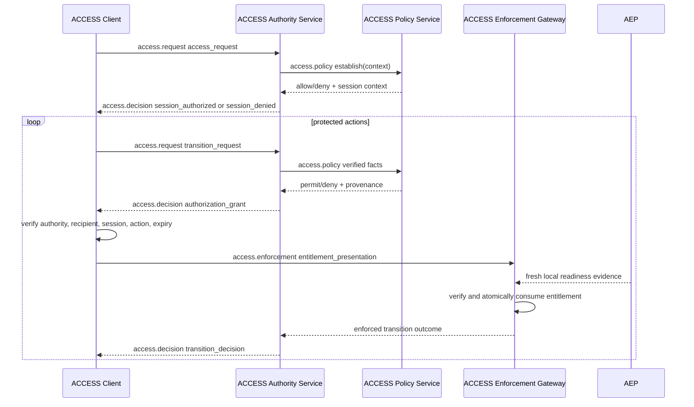

# ACCESS Protocol Flows

## Purpose

This document defines standard ACCESS interaction flows that can be reused
across mission use cases. Each flow reuses a common protocol envelope and
security invariants while varying initiation, approval path, and session
lifecycle behavior.

Use-case documents such as docking or refueling should select one flow profile
from this catalog and then specify policy, claims, and safety evidence details.

## Roles and interfaces

The canonical AC, AAS, APS, AEG, and AEP responsibilities and their reference
component mappings are defined in [architecture.md](architecture.md). This
document uses those logical roles to describe protocol ordering; co-located
roles do not imply an on-wire call.

The peer-facing interfaces are `access.request` from AC to AAS,
`access.decision` from AAS to AC, and `access.enforcement` from AC to AEG.
`access.policy` and `access.evidence` are host-side logical interfaces and may
remain in-process.

## Message primitives

Core message primitives:

- access_request
- session_authorized
- session_denied
- transition_request
- authorization_grant
- entitlement_presentation
- transition_decision

Credential exchange extension primitive:

- access_presentation (optional; explicit credential carriage)

## Mandatory invariants for all flows

1. Fail closed on unverifiable identity, stale evidence, replay, timeout,
   unknown policy version, or local verifier failure.
2. Bind every authorization decision to audience, session, requester, and time.
3. Require station-local readiness evidence for safety-critical transitions.
4. Issue narrow, short-lived, single-use entitlements for protected actions.
5. Preserve audit records for message digests, policy and trust versions,
  reason codes, and entitlement lifecycle.
6. Require the client to verify every allowed transition's signed entitlement
  against its own authority Trust Bundle before accepting the decision.

## SF1: Encounter Authorization

Canonical ACCESS request and decision exchange for encounter authorization.

Notes:

- This is the flow currently implemented by the simulation nodes.
- The chaser initiates. The station evaluates.

### SF1 wire contract and policy assessment points

The table below binds SF1 to concrete protocol exchange details and identifies
exactly where policy is assessed.

| Step | Message or action | Direction | Required protocol fields | Policy assessment |
| --- | --- | --- | --- | --- |
| 1 | access_request | chaser -> station | `protocol_version`, `kind`, `message_id`, `from`, `to`, `scenario_id`, `secure_transport_assumed`, `credential_presentation_profile` | none; request intake and structural validation only |
| 2 | establish(context) | AAS -> APS (`access.policy`) | authenticated credential, holder-proof, and scenario facts | Assessment A: ACCESS session policy over facts established by Rust verification |
| 3 | session_authorized or session_denied | AAS -> AC (`access.decision`) | `protocol_version`, `kind`, `message_id`, `from`, `to`, plus `session_id` and authorization-policy bundle metadata on allow or `reason` on deny | none; result of Assessment A |
| 4 | transition_request | AC -> AAS (`access.request`) | `protocol_version`, `kind`, `message_id`, `sequence`, `from`, `to`, `session_id`, `requested_state`, `reason` | none; request intake and session binding checks |
| 5 | authorization_grant | AAS -> AC (`access.decision`) | recipient, session, action, expiry, unique grant ID, and policy provenance | AC verifies the entitlement against its local authority Trust Bundle |
| 6 | entitlement_presentation | AC -> AEG (`access.enforcement`) | signed entitlement and the previously requested action | AEG verifies bindings, rechecks current local conditions, and atomically consumes the grant |
| 7 | transition_decision | AAS -> AC (`access.decision`) | `approved`, `reason`, `resulting_state`, and consumed grant ID | AC binds the enforced outcome to the entitlement it presented |

Credential carriage modes for SF1:

1. Reference mode (current simulator profile): `access_request` carries
  credential presentation intent, while credential artifacts are sourced by
  the station authority from configured local fixtures for deterministic
  evaluation.
2. Explicit mode (production extension): chaser sends `access_presentation`
  before session authorization; station validates cryptographic proofs and
  passes normalized facts into Assessment A.

### Credential profile

The reference profile uses VC 2.0-shaped artifacts for vehicle registration,
docking certification, and presentation:

- [vehicle registration schema](../schemas/vc-vehicle-registration-credential.schema.json)
- [docking certification schema](../schemas/vc-docking-certification-credential.schema.json)
- [ACCESS presentation schema](../schemas/vc-access-presentation.schema.json)

ACCESS does not trust verifier results supplied by the client. The AAS verifies
credential signature, validity, issuer scope, subject binding, holder proof,
freshness, and replay state before exposing normalized facts to the APS.
Unknown credentials may be retained for audit, but only configured credential
profiles influence a decision.

The reference simulator does not carry credential artifacts over the ROS peer
topics; it resolves deterministic fixtures after receiving presentation intent.
Explicit carriage through `access_presentation` remains planned. Either mode
uses the same verified-fact and entitlement semantics.

## Current implementation status

- Implemented in reference simulation: SF1 Encounter Authorization.
- Current SF1 credential mode: reference mode; explicit `access_presentation`
  is a planned extension.
- Planned protocol work: station-initiated challenge, session resume, delegated
  approval, emergency revoke/recovery, and explicit version negotiation. These
  are roadmap items, not current wire contracts.
- Trust and bundle distribution are defined in
  [security-configuration.md](security-configuration.md).
