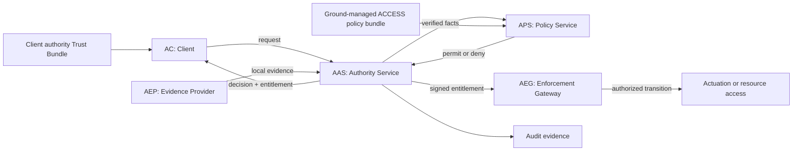
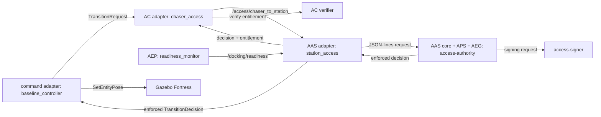

# ACCESS Architecture

## System model

ACCESS is an application-layer authorization protocol for protected interactions
between independently operated systems. It assumes mission communications
already provide an appropriate secure channel. ACCESS adds action-specific
identity, policy, entitlement, replay, and audit semantics above that channel.

Mission GNC determines whether motion is physically safe. ACCESS determines
whether the authenticated requester currently has authority for the requested
action. Authorization cannot override failed mandatory local safety conditions.

The portable boundary includes protocol claims, authorization-policy evaluation, replay state,
entitlement issuance and consumption, and deterministic failure behavior.
Transports, key stores, clocks, dynamics, and actuators connect through adapters.

## Logical roles

Roles are responsibilities, not required deployment units. An implementation may
co-locate roles if their trust boundaries and interfaces remain explicit.

| ID | Role | Responsibility | Security state owned |
| --- | --- | --- | --- |
| AC | ACCESS Client | Requests authority and verifies returned entitlements against local authority trust before accepting them | Active session binding and accepted-entitlement replay state |
| AAS | ACCESS Authority Service | Terminates ACCESS requests, authenticates evidence, manages sessions, invokes policy, and issues signed decisions and entitlements | Session, request replay, and decision state |
| APS | ACCESS Policy Service | Evaluates use-case policy over facts established by the AAS; it does not authenticate requester-supplied facts | Active policy bundle and decision metadata |
| AEG | ACCESS Enforcement Gateway | Verifies and atomically consumes an entitlement, rechecks mandatory local conditions, and releases one protected transition or action | Consumed-entitlement state and protected state machine |
| AEP | ACCESS Evidence Provider | Produces station-local readiness, navigation, or safety evidence for authorization and enforcement | Evidence provenance, timestamp, and quality state |

The AAS is the authority's security boundary. The APS is its policy decision
component and may be embedded. The AEG is
the final security gate, not telemetry or a downstream controller receiving an
already enforced result. Client entitlement verification is part of the AC role
rather than a sixth protocol role.

## Reference implementation mapping

The reference co-locates AAS, APS, and AEG security logic in the Rust
`access-authority` process:

| Logical responsibility | Reference component |
| --- | --- |
| AC protocol adapter | `chaser_access` ROS node |
| AC entitlement verification | `access-entitlement-verifier` Rust process |
| AAS transport adapter | `station_access` ROS node |
| AAS authentication and session core | `access-authority` Rust process |
| APS | Embedded ACCESS policy engine in `access-authority` |
| AEG | Entitlement verification, atomic consumption, and reducer in `AccessEngine` |
| AEP | `readiness_monitor` ROS node |
| Signing boundary | `access-signer` fixture process |
| Downstream command adapter | `baseline_controller` ROS node |

The Python station adapter delegates to the Rust authority through newline-
delimited JSON. The Rust process authenticates evidence, maps verified facts into
the APS, signs the resulting entitlement, verifies and consumes it at the embedded
AEG, advances the protected state, and returns an enforced decision. The client
verifies the returned copy independently before accepting the authority result.

The controller consumes an already-enforced station decision. Production DDS
and SROS 2 policy must prevent another ROS participant from impersonating the
station adapter on that local integration channel.

## Interfaces

| Interface | Direction | Purpose |
| --- | --- | --- |
| `access.request` | AC to AAS | Session and protected-action requests |
| `access.decision` | AAS to AC | Session results and transition decisions with entitlements |
| `access.policy` | AAS to APS | Verified authorization facts and policy result |
| `access.evidence` | AEP to AAS/AEG | Station-local readiness and safety evidence |
| `access.enforcement` | AAS to AEG | Entitlement presented for one protected action |

The reference maps peer interfaces to `/access/chaser_to_station` and
`/access/station_to_chaser`. `/docking/transition_decision` is a local adapter
contract carrying an already-enforced result to the controller, not the
normative `access.enforcement` interface.

## Trust and deployment boundaries

Secure transport authenticates and protects a channel. The station Trust Bundle
controls accepted peer and credential-issuer keys. The client Trust Bundle
controls which ACCESS authorities may issue entitlements to that client. The APS
controls use-case authorization over verified facts. These mechanisms are
complementary and none alone authorizes an action.

See [security-configuration.md](security-configuration.md) for configuration and
key boundaries, [authorization-policy.md](authorization-policy.md) for decision
and entitlement semantics, and
[access-protocol-flows.md](access-protocol-flows.md) for message sequences.

## Package status

| Package or process | Status | Responsibility |
| --- | --- | --- |
| `access_core` | Implemented | COSE/CBOR, credential verification, policy evaluation, sessions, entitlements, replay defense, and reducer |
| `docking_interfaces` | Implemented | State, request, readiness, and local decision contracts |
| `docking_orchestration` | Implemented | ROS adapters, evidence, controller, launch, dashboard, and smoke monitor |
| `docking_gazebo` | Baseline | Zero-gravity Fortress world and spacecraft instances |
| `docking_description` | Baseline | Reusable URDF/Xacro spacecraft description |
| `access-authority` | Implemented | Co-located AAS core, APS, and AEG reference process |
| `access-entitlement-verifier` | Implemented | AC authority-trust and replay verifier |
| `access-signer` | Simulation fixture | Role-bound signer; replaceable with HSM/KMS integration |
| `docking_basilisk_bridge` | Planned | Optional high-fidelity dynamics bridge |
| `docking_capture_plugin` | Planned | Compliant contact and capture constraints |

Run only one station transition authority. Authorization status and dashboard
topics are telemetry, not authority.
