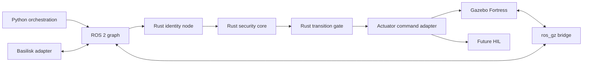
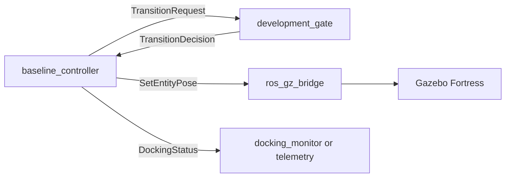
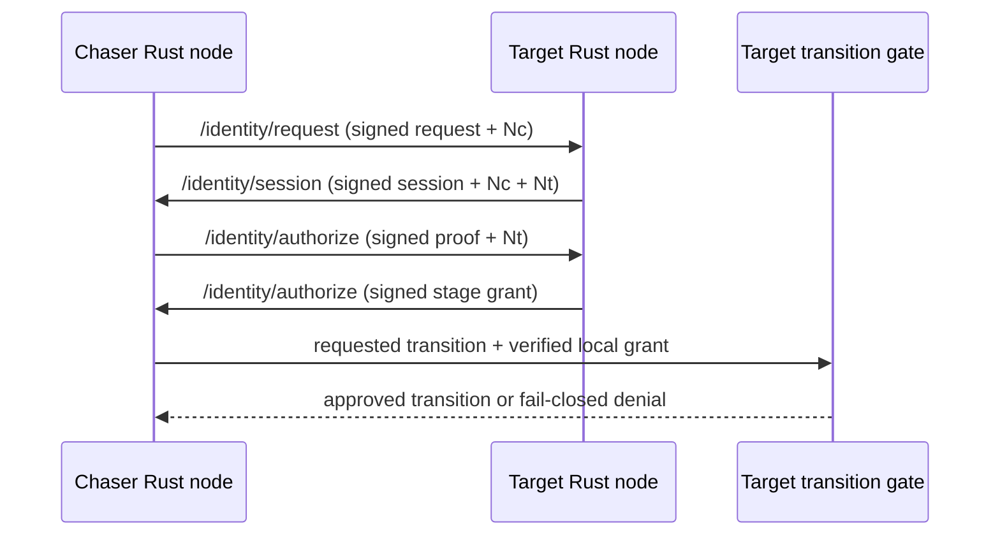

# Hybrid Architecture

## Ownership rule

Python coordinates simulation. Rust decides whether protected motion may occur.
Gazebo, Basilisk, and future hardware adapters sit outside the identity protocol,
so replacing a dynamics backend cannot alter authorization semantics.

The actuator adapter accepts protected state transitions only from the Rust gate.
An authorization-status topic is telemetry, not authority. Production systems
must also use SROS 2 governance and enclave permissions to prevent another ROS
participant from impersonating the gate at the DDS layer.

## Package status

| Package | Status | Responsibility |
| --- | --- | --- |
| `docking_identity_core` | Implemented | COSE/CBOR, trust, replay defense, policy, deterministic reducer |
| `docking_interfaces` | Implemented | Backend-neutral state, request, and decision wire contracts |
| `docking_orchestration` | Implemented baseline | Launch, deterministic controller, development gate, smoke monitor |
| `docking_gazebo` | Implemented baseline | Zero-gravity Fortress world and spacecraft instances |
| `docking_description` | Implemented baseline | Reusable URDF/Xacro spacecraft description |
| `docking_identity_node` | Next | Rust ROS adapter, session negotiation, trust-store loading |
| `docking_basilisk_bridge` | Planned | Optional high-fidelity dynamics bridge |
| `docking_capture_plugin` | Planned | Compliant contact and capture constraints |

## Current ROS graph

The development gate is the intended replacement point. `docking_identity_node`
must subscribe to `/docking/transition_request`, evaluate verified session state
through `docking_identity_core`, and publish `/docking/transition_decision`.
No controller or Gazebo changes are required for that replacement.

The normalized policy input, structured decision, and single-use entitlement
contracts are defined in [authorization-policy.md](authorization-policy.md).

Run the baseline gate and future identity gate mutually exclusively. DDS/SROS 2
policy must eventually ensure only the selected authority can publish transition
decisions.

## Identity topic contract

All three topics carry an opaque tagged COSE_Sign1 byte string. Routing metadata
may be duplicated in ROS fields for observability, but only signed CBOR claims
are authoritative.

| Topic | Direction | Signed message |
| --- | --- | --- |
| `/identity/request` | chaser to target | identity request with nonce and capabilities |
| `/identity/session` | target to chaser | session offer/challenge bound to request nonce |
| `/identity/authorize` | bidirectional | session proof or stage-limited grant |

Recommended QoS is reliable, keep-last 16, volatile durability, and a finite
lifespan shorter than the protocol freshness window. Each participant verifies
signature, issuer, recipient, freshness, nonce uniqueness, session binding, and
message type before changing local state.

## Required transition policy

| Requested state | Required evidence |
| --- | --- |
| `FINAL_APPROACH` | peer identity verified |
| `SOFT_CAPTURE` | negotiated session authorized |
| `HARD_DOCK` | explicit, unexpired docking authorization |

Abort remains available from every state and does not require authorization.
Authorization is monotonic only within one session; revocation, timeout, peer
change, or clock failure returns the gate to `HOLD` or `ABORTED` according to the
mission safety policy.

## Compatibility strategy

NASA Space ROS, OpenAMR, microgravity simulators, and Basilisk integrate through
ROS adapters and canonical state/command topics. Their native state machines do
not become trusted authorities. For the Jazzy-based OpenAMR stack, use a separate
Jazzy container and DDS-compatible IDL at the boundary instead of mixing Jazzy
packages into the Humble/Fortress image.

## Next implementation slice

The simulation baseline is ready for identity work. The next slice is:

1. Add opaque COSE envelope messages for `/identity/request`, `/identity/session`, and `/identity/authorize`.
2. Build a Rust ROS node around `docking_identity_core`.
3. Implement chaser/target challenge binding and expiring session grants.
4. Replace `development_gate` in the launch file with that Rust node.
5. Add negative smoke tests proving final approach, soft capture, and hard dock remain blocked without the corresponding evidence.

After the authorization path is integrated, simulation fidelity can increase
independently through thruster dynamics, relative navigation sensors, contact
mechanics, capture joints, MoveIt berthing, and Basilisk adapters.