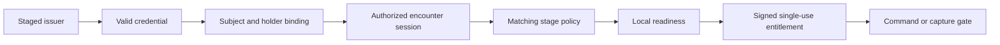

# Policy-Bound Authorization Model

## Purpose

The authorization system converts signed identity evidence, station policy, and
local operational evidence into an auditable decision and, only when allowed, a
short-lived entitlement. Staging an issuer is the first trust filter; it never
authorizes a spacecraft or operation by itself.

The JSON Schemas in `schemas/` define the logical data model and provide an
operator-friendly diagnostic representation. Protocol messages use deterministic
CBOR carried in COSE envelopes. Rust types and a CDDL profile should become the
normative wire definition before interoperability testing.

## Authorization Funnel

Each filter is mandatory when named by the selected stage policy. Failure at
any filter prevents an entitlement from being created.

## Data Ownership

The evaluation document is an internal normalized record, not a message the
chaser may assert directly.

| Data | Authoritative producer |
| --- | --- |
| Raw credentials and holder proof | Chaser, cryptographically signed |
| Issuer trust and key state | Station trust-bundle verifier |
| Credential signature, status, and time results | Station credential verifier |
| Session status and sequence | Station session manager |
| Operational readiness | Station-local navigation and safety monitors |
| Policy selection and decision | Station policy engine |
| Entitlement signature | Station authorization signer |

An arbitrary credential may be transported and audited, but it affects policy
only if its type, schema, issuer group, subject binding, and claim profile are
explicitly configured. Claim profiles are reviewed verifier implementations;
credentials cannot carry executable policy.

## Decision Algorithm

For a request and selected stage rule, the policy engine evaluates these steps
in order:

1. Validate message size, deterministic encoding, protected COSE headers,
   signature algorithm, signer key ID, audience, nonce, and freshness.
2. Select exactly one active station policy by station, port, action, previous
   stage, requested stage, and evaluation time.
3. Verify that the trust bundle is signed, unexpired, at or above the policy's
   minimum version, and not older than its maximum age.
4. Verify every required credential through its named profile. The issuer must
   be staged for that credential type and schema. Signature, validity period,
   status freshness, subject binding, and required claims must pass.
5. Verify holder possession using a fresh station challenge bound to vehicle,
   encounter identity, station, port, mission, and session.
6. Verify session status, endpoint bindings, expiration, and monotonic sequence.
7. Verify the requested transition is valid from the station's current state.
8. Verify all named readiness checks are station-produced, passing, and within
   the rule's evidence-age limit.
9. Apply station overrides. Active abort, revocation, port quarantine, or a
   violated hard constraint always denies.
10. Emit a structured decision. Only `allow` creates an entitlement, and the
    entitlement may not exceed the rule's lifetime or constraints.

Conceptually:

$$
allow = policyValid \land trustValid \land credentialsValid \land
holderBound \land sessionValid \land transitionValid \land readinessValid
\land \neg denyOverride
$$

Authorization does not override safety. A valid entitlement and current local
readiness are both required at the enforcement point.

## Outcomes

- `allow`: All required facts are established. A signed entitlement is present.
- `deny`: Verified evidence conclusively violates policy, such as an expired
  credential, invalid transition, replay, or failed readiness check.
- `indeterminate`: The engine cannot establish a required fact, such as stale
  revocation state, untrusted clock, unsupported schema, or internal failure.

Both `deny` and `indeterminate` block the operation. They remain distinct for
operator response, retry policy, and audit analysis. No exception or missing
rule may default to `allow`.

## Entitlement Rules

An entitlement is a station-signed capability for one subject, audience,
station, port, mission, session, action, and stage. It is:

- short-lived
- single-use
- bound to the request nonce and monotonic session sequence
- constrained by range, closing rate, service type, or quantity where relevant
- consumed atomically by the command or capture gate
- invalidated by expiry, abort, session revocation, subject change, or policy
  constraints becoming false

The enforcement point verifies the COSE signature and protected algorithm/key
headers, checks every binding, rechecks required local readiness, and records
the entitlement ID in durable replay state before allowing the action.

## Current Simulation Mapping

| Simulation transition | Initial policy requirement | Enforcement behavior |
| --- | --- | --- |
| `HOLD -> APPROACH` | Registered vehicle, fresh holder proof, initial hold | Remain in hold on failure |
| `APPROACH -> FINAL_APPROACH` | Identity and docking credential, authorized session | Stop at 1.120 m |
| `FINAL_APPROACH -> SOFT_CAPTURE` | Compatible interface and fresh session | Stop at 0.320 m |
| `SOFT_CAPTURE -> HARD_DOCK` | Explicit single-use hard-dock entitlement | Remain soft-captured at 0.040 m |

The current `development_gate` approves sequential transitions without this
evidence. The Rust identity node will replace it, build the normalized
evaluation input, apply the selected policy, sign an entitlement, and publish a
transition decision. The controller and Gazebo interfaces remain unchanged.

## Versioning and Audit

Policy, trust bundle, credential schema, claim profile, and protocol versions
are independent. Every decision records exact policy and evidence digests so it
can be reproduced without trusting mutable external resources.

Changes to trusted issuers or policy require signed monotonic bundles, rollback
protection, controlled activation time, and an audit trail. Unknown fields are
rejected unless a protocol version explicitly marks them non-critical.

## Artifacts

- `schemas/authorization-policy.schema.json`: declarative station policy
- `schemas/authorization-evaluation.schema.json`: normalized evaluator input
- `schemas/authorization-decision.schema.json`: decision and entitlement output
- `examples/authorization/`: allow, deny, policy, and evaluation examples

The complete operational walkthrough is documented in
[commercial-refueling-scenario.md](commercial-refueling-scenario.md).