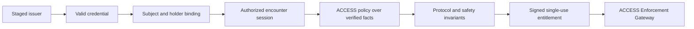

# ACCESS Authorization

## Purpose

ACCESS converts authenticated identity evidence and station-local operational
evidence into verified policy facts. An allow produces a short-lived signed
entitlement; every other outcome blocks the action. Staging an issuer only
admits its credentials for verification and never authorizes an operation.

Protocol messages use deterministic CBOR carried in COSE envelopes. The current
runtime contract is the Rust protocol model; a CDDL profile
should be published before interoperability testing.

## Responsibility boundary

The AAS authenticates evidence and enforces protocol invariants; the APS applies
ACCESS authorization policy to use-case actions over verified facts; the AEG verifies and
consumes the resulting entitlement. See [architecture.md](architecture.md) for
role boundaries. Requester-supplied verifier results are never authoritative
facts.

## Authorization funnel

Each filter is mandatory when named by the selected ACCESS Authorization Policy rule. Failure at
any filter prevents an entitlement from being created.

## Data ownership

The evaluation document is an internal normalized record, not a message the
chaser may assert directly.

| Data | Authoritative producer |
| --- | --- |
| Raw credentials and holder proof | Chaser, cryptographically signed |
| Issuer trust and key state | Station trust-bundle verifier |
| Credential signature, status, and time results | Station credential verifier |
| Session status and sequence | Station session manager |
| Operational readiness | Station-local navigation and safety monitors |
| Use-case authorization and decision | ACCESS Policy Service |
| Entitlement signature | Station authorization signer |

An arbitrary credential may be transported and audited, but it affects policy
only if its type, schema, issuer group, subject binding, and claim profile are
explicitly configured. Claim profiles are reviewed verifier implementations;
credentials cannot carry executable policy.

## Decision algorithm

For a request, the authority evaluates these steps in order:

1. Validate message size, deterministic encoding, protected COSE headers,
   signature algorithm, signer key ID, audience, nonce, and freshness.
2. Select one active policy and trust configuration for the evaluation time.
3. Verify trust version and key purpose. Invalid or unavailable configuration
   is not an authorization result.
4. Authenticate credentials through their named profiles. The issuer must be
   staged for that credential type and schema. Signature, validity period,
   status freshness, and subject binding must pass.
5. Verify holder possession using a fresh station challenge bound to vehicle,
   encounter identity, station, port, mission, and session.
6. Verify session status, endpoint bindings, expiration, and monotonic sequence.
7. Verify the requested transition is valid from the station's current state.
8. Map authenticated claim values and fresh station-produced readiness into a
   deterministic policy context; evaluate the session or stage action.
9. Apply non-overridable protocol and safety invariants. Active abort, revocation, invalid
   state, stale evidence, or entitlement binding failure always denies regardless of
   policy output.
10. Emit a structured decision. Only the intersection of policy `allow` and
   invariant success creates an entitlement within configured lifetime and
   constraints.

Conceptually:

$$
allow = policyAllow \land trustValid \land credentialsAuthentic \land
holderBound \land sessionValid \land transitionValid \land freshnessValid
\land \neg denyOverride
$$

Authorization does not override safety. A valid entitlement and current local
readiness are both required at the enforcement point.

## Policy bundle and reference engine

The APS loads the manifest selected by
`ACCESS_AUTHORIZATION_POLICY_BUNDLE_FILE`. The bundle supplies a stable ID,
monotonic version, validity interval, and policy source. Startup fails closed
when the bundle is unavailable, outside its validity window, or cannot be
parsed. Policy is loaded once rather than in the transition loop.

The public artifact is an **ACCESS Authorization Policy Bundle**. The reference
APS implements its policy source with the Cedar engine and Cedar syntax; Cedar
is an internal technology choice, not a peer-facing component or protocol term.

The active reference artifacts are:

- [authorization policy bundle](../config/access/access-authorization-policy-bundle.json)
- [bundle schema](../schemas/access-authorization-policy-bundle.schema.json)
- [commercial docking policy source](../examples/authorization/policies/commercial-docking.cedar)

## Verified facts and provenance

Policy input can include authenticated credential profiles, holder-proof state,
session state, requested action, and fresh station-local readiness values. Trust,
signature validity, session authorization, and readiness flags supplied by a
requester are not accepted as facts.

Each allow binds the ACCESS authorization policy bundle ID, version, and source
SHA-256 digest into the signed entitlement alongside the protocol profile and
matched rule. The AC verifies the issued entitlement against its authority Trust
Bundle and presents it when invoking the approved action. The AEG verifies the
bindings, rechecks local conditions, and atomically consumes the entitlement
before releasing one protected transition.

## Outcomes

- authorization allowed: all required facts and invariants passed; a signed
   entitlement and policy provenance are returned to the AC without releasing
   the action.
- redemption accepted: the AEG verified and consumed the presented entitlement
   before releasing the action.
- `approved: false`: the authority rejected the request and returns a stable
   reason code plus available rule and policy context.
- authority processing or configuration failure: the JSON-lines request fails
   and the adapter blocks the operation. It is not converted into an allow or a
   synthetic peer decision.

No exception, unavailable fact, or missing rule defaults to approval.

## Entitlement rules

An entitlement is a station-signed capability bound to one authority, client
recipient, session, stage, protocol profile, matched rule, and authorization
policy bundle. It is:

- short-lived
- single-use
- bound to a unique entitlement ID and signed policy provenance
- consumed atomically by the AEG
- invalidated by expiry, replay, session mismatch, recipient mismatch, stage
   mismatch, or provenance mismatch

The station enforcement point verifies the COSE signature and protected algorithm/key
headers, checks every binding, rechecks required local readiness, and records
the entitlement ID in durable replay state before allowing the action.

The AC independently verifies the issued entitlement before presenting it for
enforcement. See [security-configuration.md](security-configuration.md)
for authority Trust Bundle and replay requirements. The docking-specific policy
and enforcement walkthrough is in
[commercial-refueling-scenario.md](commercial-refueling-scenario.md).

## Versioning and audit

Policy, trust bundle, credential schema, claim profile, and protocol versions
are independent. Every decision records exact policy and evidence digests so it
can be reproduced without trusting mutable external resources.

Production changes to trust or policy require authenticated monotonic bundles,
rollback protection, controlled activation, and an audit trail. Unknown fields
are rejected unless a protocol version marks them non-critical.

The complete operational walkthrough is documented in
[commercial-refueling-scenario.md](commercial-refueling-scenario.md).