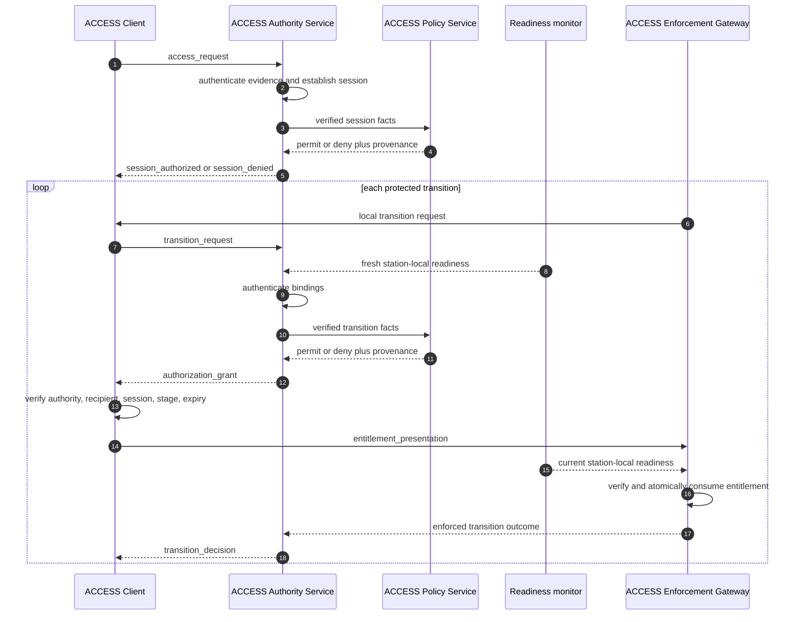

# Commercial Refueling Reference Scenario

## Scenario

Commercial tug **Odyssey-7**, operated by **Lunar Logistics**, requests docking
and methane refueling at **Waystation-1**, port 3. The station is operated by a
different organization and does not trust the tug merely because it can use a
protected communications channel.

The station must establish four distinct facts:

1. Credential issuers were approved through station governance.
2. Odyssey-7 holds valid credentials from those issuers.
3. The presenter controls the encounter key for this session.
4. Every requested operation satisfies current ACCESS authorization policy and local readiness.

The visual simulation uses deterministic cryptographic fixtures and the canonical
role model defined in [architecture.md](architecture.md). Live DID resolution and
online revocation services are not implemented.

## Actors

| Actor | Reference identifier | Role |
| --- | --- | --- |
| Station | `waystation-1` | ACCESS authority and resource owner |
| Station port | `port-3` | Physical and authorization resource |
| Chaser | `odyssey-7` | ACCESS client and credential subject |
| Operator | `lunar-logistics` | Vehicle operator |
| Registrar | `lunar-registry` | Vehicle-registration credential issuer |
| Docking authority | `orbital-safety` | Docking-certification issuer |
| Readiness monitor | station-local ROS node | Produces trusted operational evidence |

The fixture identifiers are intentionally local. Production profiles may use
DIDs or X.509 identities through reviewed verifier adapters.

## Phase 0: Ground provisioning

Ground operations provision three independent configuration classes:

1. The station Trust Bundle defines accepted peer, credential-issuer, and key
   purposes. Staging an issuer allows its credentials into authentication; it
   does not authorize a spacecraft or operation.
2. The [ACCESS Authorization Policy Bundle](../config/access/access-authorization-policy-bundle.json)
  selects the active use-case policy, version, and validity window.
3. Odyssey-7's client Trust Bundle pins Waystation-1's authority ID and
   entitlement-signing public key. It is independent of the station's issuer
   Trust Bundle.

The [protocol profile](../config/access/access-protocol-profile.json) defines
cryptographic, freshness, state, and entitlement constraints. ACCESS
Authorization Policy defines required verified claims, readiness combinations,
and operational limits.

## Phase 1: Session establishment

This scenario instantiates SF1 Encounter Authorization from
[access-protocol-flows.md](access-protocol-flows.md).

In reference mode, the chaser sends presentation intent and the authority loads
deterministic credential fixtures. Explicit credential carriage is a planned
production extension. In either mode, request-provided verifier booleans are not
trusted; the APS receives only facts established by the authority.

## Phase 2: Credential and holder authentication

The scenario uses:

- `VehicleRegistrationCredential`, binding Odyssey-7 to Lunar Logistics
- `DockingCertificationCredential`, asserting an IDSS-compatible interface
- a holder proof bound to challenge, client, authority, session, and credential
  digests

Rust validates issuer key scope, signatures, validity intervals, subject and
holder bindings, message freshness, and replay state. The APS then decides whether
the authenticated claim values satisfy the active ACCESS policy rules.

## Phase 3: Authorized transitions

| Range and request | ACCESS policy and invariant decision | Simulation effect |
| --- | --- | --- |
| `3.320 m`, `HOLD -> APPROACH` | Registration, holder proof, session, and initial hold pass | `enter_approach` entitlement is consumed; motion starts |
| `1.120 m`, `APPROACH -> FINAL_APPROACH` | Docking certification, corridor, and closing-rate limits pass | `enter_final_approach` entitlement is consumed |
| `0.320 m`, `FINAL_APPROACH -> SOFT_CAPTURE` | Interface, alignment, and capture readiness pass | `engage_soft_capture` entitlement is consumed |
| `0.040 m`, `SOFT_CAPTURE -> HARD_DOCK` | Soft capture, latch readiness, and stable relative motion pass | `engage_hard_dock` entitlement is consumed |

Each allow requires both an ACCESS policy permit and successful protocol/safety
invariants. The client verifies and presents the signed entitlement for the
requested transition. The station AEG rechecks local readiness, consumes the
entitlement before state progression, and returns the enforced result.
Detailed bindings are defined in
[authorization-policy.md](authorization-policy.md).

Failure creates no accepted entitlement. The deterministic profiles demonstrate
credential expiration, corridor violation, and incomplete latch telemetry through
the executable Rust and end-to-end simulation tests.

## Phase 4: Resource service

Docking does not imply authority to use station resources. Methane transfer is a
future ACCESS policy action and enforcement gate that would require commercial
clearance, valve and pressure compatibility, metering readiness, quantity limits,
and emergency shutdown availability. The current simulation stops at hard dock.

## Audit and replay

The authority records decision inputs, policy provenance, reason codes, and
entitlement consumption. The client maintains a separate durable replay journal.
Private key material is not part of audit output.

## Demonstrated outcomes

| Profile | Denied gate | Evidence shown |
| --- | --- | --- |
| Nominal authorization | None | Four signed single-use entitlements |
| Expired vehicle credential | Enter approach | Credential expiry and verifier time |
| Approach corridor violation | Enter final approach | Cross-track and closing-rate limits |
| Latch telemetry incomplete | Engage hard dock | Latch count and relative-motion evidence |

Run instructions are maintained in the repository [README](../README.md).

## Reference boundary

This is an executable authorization demonstration, not production key or
configuration infrastructure. Fixture keys are public and bundles are locally
configured. Production gaps are tracked in [roadmap.md](roadmap.md) and
[security-configuration.md](security-configuration.md).
